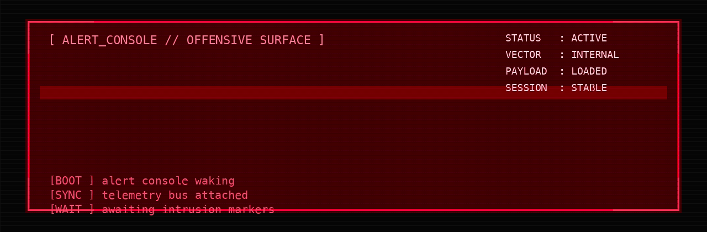

# SYSTEM BREACHED // yyhuni

### [!] THREAT PROFILE
>
> **[ PROFILE ] OFFENSIVE SECURITY RESEARCHER // AUTOMATION BUILDER**
>
> `Weaponizing repeatable workflows into sharp, reusable offensive tooling.`

`> Recon first, execution second` / `> Automate first, manual second` / `> Signal over noise`

### [!] ACTIVE MODULES

  
  
  

### [!] TELEMETRY

  <picture>
    <source media="(prefers-color-scheme: dark)" srcset="https://github-readme-stats-fast.vercel.app/api?username=yyhuni&show_icons=true&theme=radical&hide_border=true&bg_color=0D1117">
    <source media="(prefers-color-scheme: light)" srcset="https://github-readme-stats-fast.vercel.app/api?username=yyhuni&show_icons=true&theme=radical&hide_border=false">
    
  </picture>

### [!] TARGET INVENTORY
<!-- TOP_REPOS_START -->
### Top 6 by Stars

| Repository | Stars | Forks | Updated | Description |
| --- | ---: | ---: | --- | --- |
| [xingrin](https://github.com/yyhuni/xingrin) | 456 | 64 | 2026-03-04 | src资产管理漏洞扫描平台，子域名爆破，端口扫描，站点发现，目录扫描，爬虫，漏洞扫描 |
| [shiroMemshell](https://github.com/yyhuni/shiroMemshell) | 37 | 12 | 2025-11-26 | 利用shiro反序列化注入冰蝎内存马 |
| [xingfinger](https://github.com/yyhuni/xingfinger) | 31 | 3 | 2026-03-04 | XingFinger 是一款高效的 Web 指纹识别工具，基于 chainreactors/fingers 多指纹库聚合引擎，帮助安全人员快速识别目标系统的技术栈。 |
| [fingerprint-files](https://github.com/yyhuni/fingerprint-files) | 9 | 3 | 2026-03-04 | - |
| [lunafox](https://github.com/yyhuni/lunafox) | 0 | 0 | 2026-02-28 | - |
| [lunafox-sse-push](https://github.com/yyhuni/lunafox-sse-push) | 0 | 0 | 2026-02-05 | - |
<!-- TOP_REPOS_END -->

### [!] OPERATION STATUS

<picture>
  <source media="(prefers-color-scheme: dark)" srcset="https://raw.githubusercontent.com/yyhuni/yyhuni/output/github-contribution-grid-snake-dark.svg">
  <source media="(prefers-color-scheme: light)" srcset="https://raw.githubusercontent.com/yyhuni/yyhuni/output/github-contribution-grid-snake.svg">
  
</picture>

`NOISE IS CHEAP. SIGNAL WINS.`
